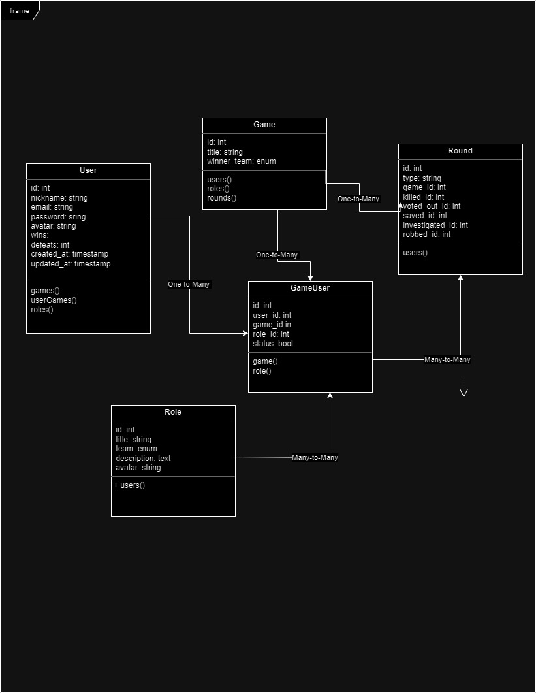

# Mafia Game

Welcome to the Mafia Game, a web-based implementation of the classic party game Mafia.

## Table of Contents
- [Introduction](#introduction)
- [Installation](#installation)
- [How to Play](#how-to-play)
- [Roles](#roles)
- [UML Diagram](#uml)
- [License](#license)

## Introduction

The Mafia Game is an online version of the popular social deduction game where players take on roles as either Mafia members or innocent villagers. The objective is to identify and eliminate the Mafia members or, if you are a Mafia member, to eliminate the villagers.

## Installation

### Prerequisites

Before you begin, ensure you have the following dependencies installed on your machine:

- [PHP](https://www.php.net/) (version X.X.X)
- [Composer](https://getcomposer.org/)
- [Node.js](https://nodejs.org/)
- [npm](https://www.npmjs.com/)

### Steps

1. Clone the repository:

    ```bash
    git clone https://github.com/DjellzeBllaca/MafiaGame.git
    ```

2. Navigate to the project directory:

    ```bash
    cd mafiagame
    ```

3. Install PHP dependencies:

    ```bash
    composer install
    ```

4. Install JavaScript dependencies:

    ```bash
    npm install
    ```

5. Create a `.env` file by copying the `.env.example` file and updating it with your configuration:

    ```bash
    cp .env.example .env
    ```

    Set your database connection details, application key, and other necessary configurations in the `.env` file.

6. Generate an application key:

    ```bash
    php artisan key:generate
    ```

7. Run database migrations and seed the database:

    ```bash
    php artisan migrate --seed
    ```
8. Create symbolic link

    ```
    php artisan storage:link
    ```

9. Start the development server:

    ```bash
    php artisan serve
    ```

    Your Mafia Game is now accessible at `http://localhost:8000`.

## How to Play

1. **Create an Account:**
    - Visit the registration page and create a new account.

2. **Start a Game:**
    - Navigate to the dashboard and start a new game.
    - Invite friends to join the game.

3. **Roles Assignment:**
    - The game will automatically assign roles to each player.

4. **Day/Night Rounds:**
    - Follow the instructions during the day and night rounds.
    - Participate in votes during the day, and perform night actions based on your role.

5. **Winning the Game:**
    - The game ends when one of the teams (Mafia or Villagers) wins.

## Roles

There are 5 roles in the Mafia Game:

1. **Villager:**
   - *Sided with the Village*
   -An important member of the Village for voting and figuring out who the Mafia is. Wins if all Mafia are dead. The Villager votes every day.

2. **Detective:**
   - *Sided with the Village*
   - The Cop investigates one person each night and receives intel on their alignment (Mafia or Village).

3. **Doctor:**
   - *Sided with the Village*
   - The Doctor visits one person each night and protects them from dying that night. That person will not die if they are killed the same night as the Doctor visits.

4. **Mafia:**
   - *Sided with the Mafia*
   - Visits and kills one person each night. Wins if the Mafia outnumber the Village.

5. **Thief:**
   - *Sided with the Mafia*
   - The Thief is the mafioso who specializes in burglary. Has two attempts to steal per game. Can steal the ability to investigate from the Detective and the ability to save a life from the Doctor, but can't use them. Roles will not recover stolen items for the rest of the game. In addition, if there are no more Mafias alive, the Thief inherits the mafias ability to kill.

## UML




## License

This project is licensed under the [MIT License](LICENSE).
